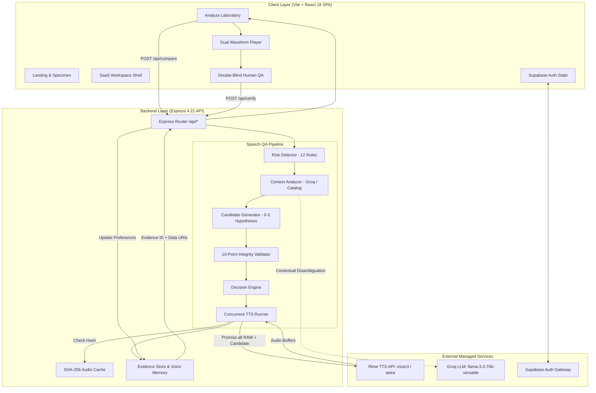

# SaySure — System Architecture

> **Technical Architecture Specification for SaySure.**  
> **Target**: Voice Delivery & Pronunciation QA  
> **Stack**: Bare Vite 5 + React 18 + TypeScript + Express 4.21 + Rime TTS

---

## 1. High-Level Architectural Diagram

SaySure operates as an **independent speech-quality control layer** inserted between user application content and Rime Text-to-Speech:



---

## 2. Layer-by-Layer Architectural Breakdown

### Layer 1: Client Application (Vite + React 18 SPA)
- **Framework**: Bare Vite 5 running React 18 without meta-framework overhead.
- **Routing**: `react-router-dom` v6 manages all client-side navigation:
  - Public routes: `/` (Landing), `/login`, `/signup`, `/forgot-password`, `/reset-password`, `/auth/callback`.
  - Protected SaaS routes: `/dashboard`, `/dashboard/analyze`, `/dashboard/history`, `/dashboard/projects`, `/dashboard/docs`, `/dashboard/settings`, `/dashboard/account`.
- **Styling & Motion**: Tailwind CSS v3 with hardware-accelerated micro-animations powered by Framer Motion v11.
- **State Management**:
  - `AuthProvider.tsx`: Reactive Supabase authentication context.
  - `history-store.ts`: Local client persistence of past speech checks.
  - React component state for local waveform, playback, and form state.

### Layer 2: API Gateway (Express 4.21 Backend)
- **Runtime**: Node.js executed via `tsx` on port `3001`.
- **Proxy Configuration**: `vite.config.ts` proxies `/api` calls from client (port `3000`) to Express (port `3001`).
- **Endpoint Structure**:
  - `GET /api/config`: Returns public Rime and Groq configuration status.
  - `POST /api/analyze`: Performs linguistic scanning, candidate expansion, and validation without audio synthesis.
  - `POST /api/compare`: Orchestrates concurrent Rime dual synthesis, decision computation, and provenance logging.
  - `POST /api/synthesize`: Synthesizes single audio stream directly using the SHA-256 cache.
  - `POST /api/verify`: Records double-blind human listener evaluation into evidence memory.

### Layer 3: Voice Quality & Linguistic Engine
Implemented across modular TypeScript libraries in `src/lib/`:

```
src/lib/
├── risk-detector.ts           # Orchestrates 13 specialized risk rule scanners
├── risk-rules/                # Individual regex & pattern rules
│   ├── identifiers.ts         # Alphanumeric codes (A12B9X7, INV-2048-X)
│   ├── currency.ts            # Rupee lakh grouping (₹1,25,000), dollars ($1,249.50)
│   ├── acronyms.ts            # Status codes (HTTP 429), initialisms (AWS, JWT)
│   ├── domain-terms.ts        # Known technical vocab (Kubernetes, PostgreSQL, gRPC)
│   ├── dates.ts               # Slash & hyphen dates (17/09/2026, 03/15/2026)
│   ├── times.ts               # 24-hour & timezone expressions (14:30 IST)
│   ├── urls.ts & emails.ts    # Web addresses and emails
│   ├── addresses.ts           # Building & complex names (12/B, BKC)
│   └── ambiguous.ts           # Novel/unverified tokens (XyloQ)
├── context-analyzer.ts        # Surrounding context evaluation via Groq with catalog bypass
├── candidate-generator.ts     # Generates 0–3 ranked spoken representations
├── validators.ts              # 10-point candidate preservation validator
├── decision-engine.ts         # Strict evaluation hierarchy (KEEP_RAW, USE_CONTROLLED, etc.)
└── pronunciation-knowledge.ts # 3-way pronunciation representation catalog
```

### Layer 4: Speech Execution & Audition (Rime TTS)
- **Official Client** ([`src/lib/rime.ts`](file:///d:/DataForge/DataForge_NullPointer/src/lib/rime.ts)): Connects to `https://users.rime.ai/v1/rime-tts` using the `mistv3` model and `astra` voice.
- **Fair Experiment Runner** ([`src/lib/tts-runner.ts`](file:///d:/DataForge/DataForge_NullPointer/src/lib/tts-runner.ts)): Runs RAW and candidate text concurrently via `Promise.all` under identical request headers and sampling parameters.
- **In-Memory SHA-256 Cache**:
  ```ts
  key = sha256(text + model + voice + language + format)
  ```
  Cached requests return in **`0ms`**, avoiding unnecessary API spend during repetitive testing.
- **Audio Transport**: Encodes MP3 buffers as Base64 Data URIs (`data:audio/mpeg;base64,...`) for instant HTML5 playback and one-click downloading.

### Layer 5: Evidence & Memory Layer
- **Provenance Store** ([`src/lib/evidence-memory.ts`](file:///d:/DataForge/DataForge_NullPointer/src/lib/evidence-memory.ts)): Logs every comparison under a unique ID (`ev-...`) with input, candidate, matched rule, model, voice, latency, decision, and verification state.
- **Voice Preference Memory** (`VERIFIED_PREFERENCES`): Associates verified human preferences with specific `term:voice` combinations so that human verification permanently updates future suggestions.

### Layer 6: Identity & Authentication
- **Provider**: Supabase Auth (`@supabase/supabase-js`).
- **Flow**: Email/password and Google OAuth.
- **Storage**: Client-side `localStorage` under `saysure_auth_session_v1`.
- **Protection**: [`src/components/auth/ProtectedRoute.tsx`](file:///d:/DataForge/DataForge_NullPointer/src/components/auth/ProtectedRoute.tsx) guards workspace routes.

---

## 3. The 10-Point Candidate Validation Checklist

Before any candidate text is permitted to be synthesized, [`src/lib/validators.ts`](file:///d:/DataForge/DataForge_NullPointer/src/lib/validators.ts) executes a 10-point checklist:

1. **Output Sanity**: Output cannot be empty or solely whitespace.
2. **Length Sanity**: Controlled text cannot exceed 3.5x original length (prevents prompt run-on).
3. **Identifier Preservation**: Every single alphanumeric character in codes like `A12B9X7` must be accounted for.
4. **Numeric Preservation**: Digits cannot be dropped or silently changed.
5. **Currency Preservation**: Localized denominations (lakhs, thousands) must match the numeric value.
6. **Date & Time Preservation**: Calendar days, months, years, and timezones must be preserved.
7. **Entity Preservation**: Technical terms must not be mangled or arbitrarily renamed.
8. **Version Preservation**: Attached version numbers (e.g., `v16`) must remain intact and cannot merge into previous words.
9. **Semantic Preservation**: Negations (*not*, *failed*, *refused*) must never be flipped.
10. **Minimal Intervention**: Text surrounding speech-risk tokens must remain completely untouched.

If any check fails, SaySure marks `reviewRequired: true` and the decision engine forces `NEEDS_REVIEW`.

---

## 4. Decision Engine State Machine

The decision engine ([`src/lib/decision-engine.ts`](file:///d:/DataForge/DataForge_NullPointer/src/lib/decision-engine.ts)) strictly governs the outcome of every audition:

```
                            Decision Input
                                  │
                 ┌────────────────┴────────────────┐
                 ▼                                 ▼
      Security Warning Present?           TTS Synthesis Error?
                 │                                 │
           YES → NEEDS_REVIEW                 YES → ERROR
                 │
                 ▼
       Validation Failure Present?
                 │
           YES → NEEDS_REVIEW
                 │
                 ▼
       Human Preference Stored?
                 │
           YES → Honor Stored Preference (RAW / CONTROLLED / SAME)
                 │
                 ▼
       No Text Changes Proposed?
                 │
           YES → SAME_AS_RAW
                 │
                 ▼
       Token Contains NEEDS_REVIEW?
                 │
           YES → NEEDS_REVIEW (Uncertainty surfaced)
                 │
                 ▼
       Token Retained Native Rime?
                 │
           YES → KEEP_RAW (Native Rime wins)
                 │
                 ▼
       Controlled Candidate Passed Checks?
                 │
           YES → USE_CONTROLLED (Controlled candidate wins)
```

---

## 5. Data Models & Schemas

Key types defined in [`src/lib/schemas.ts`](file:///d:/DataForge/DataForge_NullPointer/src/lib/schemas.ts):

```ts
export type RiskCategory =
  | 'identifier'
  | 'currency'
  | 'acronym'
  | 'domain_term'
  | 'date'
  | 'time'
  | 'url'
  | 'email'
  | 'abbreviation'
  | 'number'
  | 'address'
  | 'name'
  | 'ambiguous'
  | 'code_switched';

export type DecisionStatus =
  | 'KEEP_RAW'
  | 'USE_CONTROLLED'
  | 'SAME_AS_RAW'
  | 'NEEDS_REVIEW'
  | 'ERROR';

export interface SpeechRisk {
  id: string;
  text: string;
  start: number;
  end: number;
  category: RiskCategory;
  severity: 'high' | 'medium' | 'low';
  detectionMethod: 'deterministic' | 'contextual';
  reason: string;
  interventionRecommended: boolean;
  investigationRequired: boolean;
  confidence: 'HIGH' | 'MEDIUM' | 'LOW' | 'NEEDS_REVIEW';
}

export interface ComparisonResult {
  originalText: string;
  controlledText: string;
  candidates: CandidateItem[];
  risks: SpeechRisk[];
  decision: InvestigationDecision;
  reviewRequired: boolean;
  reviewReasons?: string[];
  safetyWarning?: string | null;
  evidenceId: string;
  rawAudio: RimeSynthesisResult;
  controlledAudio: RimeSynthesisResult;
  rime: RimeConfigPublic;
  timing: {
    analysisMs: number;
    rawAudioMs: number;
    controlledAudioMs: number;
    totalMs: number;
  };
}
```
